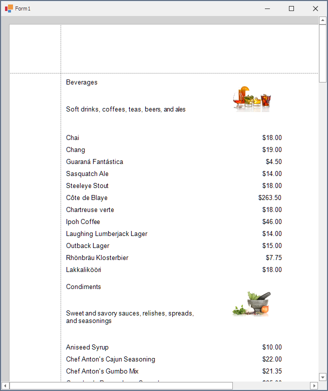

<!-- default badges list -->

<!-- default badges end -->
# Reporting for WinForms - Master-Detail Report with a Subreport

This example shows the master-detail report created with the [XRSubreport](https://docs.devexpress.com/XtraReports/DevExpress.XtraReports.UI.XRSubreport) control and illustrates the following help topic: [Create a Master-Detail Report with a Subreport](https://docs.devexpress.com/XtraReports/4629/create-reports/create-a-master-detail-report-with-a-subreport).

## Files to Look At

- [Form1.cs](CS/dxSampleMasterDetailSubreport/Form1.cs) (VB: [Form1.vb](VB/dxSampleMasterDetailSubreport/Form1.vb))

## Documentation

- [Create a Master-Detail Report with a Subreport](https://docs.devexpress.com/XtraReports/4629/create-reports/create-a-master-detail-report-with-a-subreport)

## More Examples

- [Reporting for WinForms - How to Create a Report Bound to the SQL Data Source](https://github.com/DevExpress-Examples/Create-a-Report-Bound-To-SqlDataSource)
- [How to bind a report to a federated master-detail data source](https://github.com/DevExpress-Examples/Reporting-Bind-Report-To-Federated-Master-Detail-Data-Source)
- [Use Subreports to Add a Chart](https://github.com/DevExpress-Examples/Reporting-Use-Subreport-To-Add-A-Chart)

<!-- feedback -->
## Does this example address your development requirements/objectives?

 

(you will be redirected to DevExpress.com to submit your response)
<!-- feedback end -->
